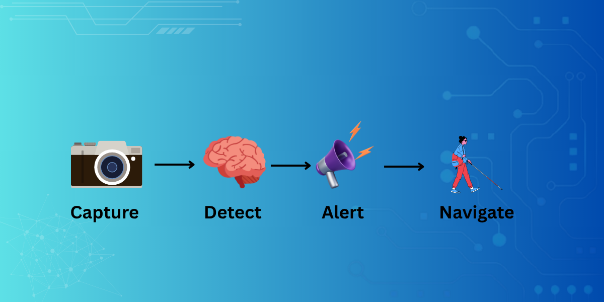

<div align="center">

<h1>
  
  Vision<strong>AI</strong>d
</h1>

<p><strong>AI-Powered Wearable Assistive Device for Visually Impaired Individuals</strong></p>

<p><em>Guiding Every Step with AI.</em></p>



<p>


</p>

</div>

---

## Overview

VisionAId is an AI-powered wearable assistive system designed to improve the safety and independence of visually impaired individuals.

The system integrates **computer vision**, **embedded systems**, and **speech technologies** to provide:

- Real-time object recognition
- Obstacle detection and voice alerts
- Emergency SMS communication
- Voice-guided navigation assistance

---

## Key Features

- Real-time object detection using **YOLOv3-Tiny**
- Obstacle detection using **ultrasonic sensing**
- Text-to-Speech and Speech-to-Text support
- Bluetooth-based communication
- GSM-enabled emergency messaging
- Offline functionality
- Lightweight and cost-effective prototype

---

## System Architecture

<p align="center">

</p>

---

## Technology Stack

| Category | Technologies |
|----------|--------------|
| Programming | Python, C/C++ |
| Computer Vision | OpenCV, YOLOv3-Tiny |
| Embedded Systems | Arduino Nano |
| Communication | Bluetooth, GSM |
| Mobile Application | Android, TTS, STT |

---

## Hardware Components

- Arduino Nano
- HC-SR04 Ultrasonic Sensor
- HC-05 Bluetooth Module
- GSM Module
- Camera
- Buck Converter
- Regulated Power Supply
- Android Smartphone

---

## Workflow

```text
Camera + Ultrasonic Sensor
            ↓
YOLOv3-Tiny + Arduino Nano
            ↓
     Bluetooth Communication
            ↓
      Android Application
            ↓
      Voice Guidance & Alerts
```

---

## Results

- Successfully detected **19 object classes** in real time.
- Generated immediate voice alerts for nearby obstacles.
- Enabled emergency SMS communication through voice commands.
- Achieved reliable communication between hardware and the Android application.

---

## Future Work

- Raspberry Pi deployment
- GPS-based navigation
- OCR and currency recognition
- Face recognition
- Miniaturized wearable design

---

## Repository Structure

```text
VisionAId
├── assets
├── AI_Model
├── Arduino
├── Android_App
├── Hardware
├── Dataset
├── Documentation
└── README.md
```

---

## My Contributions

- System design and architecture
- Hardware planning and integration
- Dataset preparation and research
- AI model integration
- Testing and validation
- Technical documentation and presentation

---

## Status

**Prototype V1 – Completed**

Developed as a final-year undergraduate major project in the field of **Assistive Technology and Artificial Intelligence**.

---

## License

This project is intended for academic and research purposes.
